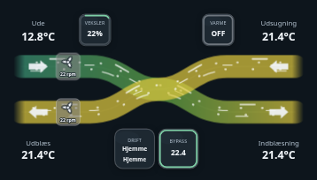
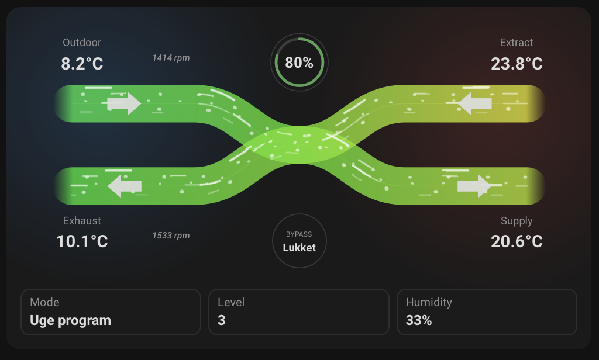

# HRV Card

## Neutral mobile preview



> Rendered at 390 px mobile width with fictional Home Assistant entities and values. No private dashboard, person, address, camera, or sensor data is included.




<p align="center">

<a href="https://github.com/Ralleberg/ha-hrv-card/releases">
  
</a>

<a href="https://github.com/Ralleberg/ha-hrv-card/blob/main/LICENSE">
  
</a>

<a href="https://github.com/Ralleberg/ha-hrv-card/releases">
  
</a>

<a href="https://www.home-assistant.io/">
  
</a>

</p>

<p align="center">

<a href="https://my.home-assistant.io/redirect/hacs_repository/?owner=Ralleberg&repository=ha-hrv-card&category=dashboard">
  
</a>

</p>

---

## Overview

**HRV Card** is a modern, animated Lovelace card for **Home Assistant** that visualizes and controls Heat Recovery Ventilation (HRV) and Energy Recovery Ventilation (ERV) systems.

The card provides a clear overview of airflow, temperatures, heat recovery efficiency, humidity, bypass state, fan speed, operation mode, alarms, filter status, CO₂ levels and optional fan RPM values in a single compact interface.

Unlike vendor-specific cards, **HRV Card is completely vendor-neutral**. If your Home Assistant integration exposes the required entities, the card will work regardless of manufacturer.

The built-in defaults for Dantherm writable controls are based on the excellent Home Assistant integration from **Tvalley71/dantherm**.

---

# Features

- 🌬️ Animated airflow visualization
- 🌡️ Temperature-based airflow gradients
- ♻️ Heat recovery efficiency indicator
- 💨 Fan level and operation mode controls
- 🚪 Automatic bypass visualization
- 💧 Humidity indicator
- 🫧 Optional CO₂ indicator
- ⚠️ Alarm indicator
- 🧹 Filter lifetime indicator
- 🔄 Optional fan RPM display
- 🎨 Automatic Danish / English translations
- 📱 Responsive layout
- ⚙️ Vendor-neutral configuration
- 🧩 Works with partial configurations (missing entities are automatically hidden)
- 🚀 HACS compatible

---

# Supported Systems

HRV Card is designed to work with any ventilation system that exposes standard Home Assistant entities.

The following systems have been tested.

| Manufacturer | Status |
|---------------|--------|
| Dantherm | ✅ Fully supported |
| Genvex | ✅ Fully supported |
| Nilan | ✅ Fully supported |
| Danfoss Air | ✅ Fully supported |
| Itho Daalderop HRU | ✅ Fully supported |

Other HRV and ERV systems should work by mapping the available entities manually.

---

# Installation

## HACS (Recommended)

Click below to add the repository directly to HACS.

<p align="center">

<a href="https://my.home-assistant.io/redirect/hacs_repository/?owner=Ralleberg&repository=ha-hrv-card&category=dashboard">

</a>

</p>

After adding the repository:

1. Open **HACS**
2. Install **HRV Card**
3. Refresh your browser
4. Add the card to your dashboard

---

## Manual Installation

Copy

```
ha-hrv-card.js
```

to

```
/config/www/community/ha-hrv-card/
```

Then add the resource:

```yaml
url: /local/community/ha-hrv-card/ha-hrv-card.js
type: module
```

Refresh your browser afterwards.

---

# Example Configuration

```yaml
type: custom:hrv-card

entities:
  outdoor_temperature: sensor.dantherm_outdoor_temperature
  supply_temperature: sensor.dantherm_supply_temperature
  extract_temperature: sensor.dantherm_extract_temperature
  exhaust_temperature: sensor.dantherm_exhaust_temperature

  heat_recovery: sensor.dantherm_heat_recovery_efficiency

  humidity: sensor.dantherm_humidity

  bypass: cover.dantherm_bypass_damper

  mode: select.dantherm_operation_selection

  level: select.dantherm_fan_level_selection

  fan1_rpm: sensor.dantherm_fan2_speed
  fan2_rpm: sensor.dantherm_fan1_speed

appearance:
  animation: true
  show_labels: true
  show_badges: true
  show_temperatures: true
```

The remaining configuration options are entirely optional.

---

# Entity Overview

| Entity | Required | Description |
|----------|----------|-------------|
| Outdoor temperature | ✅ | Outdoor / fresh air temperature |
| Supply temperature | ✅ | Supply air temperature |
| Extract temperature | ✅ | Extract air temperature |
| Exhaust temperature | ✅ | Exhaust air temperature |
| Heat recovery | Optional | Heat recovery efficiency (%) |
| Humidity | Optional | Relative humidity |
| CO₂ | Optional | Indoor CO₂ level |
| Bypass | Optional | Bypass state |
| Mode | Optional | Ventilation mode |
| Fan level | Optional | Ventilation level |
| Alarm | Optional | Active alarm indicator |
| Filter days | Optional | Remaining filter lifetime |
| Fan RPM | Optional | Individual fan speeds |

---

# Heat Recovery Calculation

The card expects a percentage sensor for **heat recovery efficiency**.

A commonly used formula is

```text
((Supply - Outdoor) / (Extract - Outdoor)) × 100
```

The recommended Home Assistant template clamps the result between **0%** and **100%**, supports both heating and cooling recovery and automatically returns `None` whenever the calculation cannot be performed.

A complete template sensor example is shown below.## Heat Recovery Efficiency Template Sensor

The following template sensor calculates heat recovery efficiency from the four temperature sensors.

It automatically:

- Returns **0%** when the bypass damper is open.
- Clamps the result between **0%** and **100%**.
- Supports both heating and summer cooling recovery.
- Returns `None` when the calculation cannot be performed.

```yaml
template:
  - sensor:
      - name: Dantherm Heat Recovery Efficiency
        unique_id: dantherm_heat_recovery_efficiency
        unit_of_measurement: "%"
        state: >
          
          
          
          

          
            0
          
            
            {{ [0, [efficiency, 100] | min] | max | round(1) }}
          
            {{ none }}
          
```

---

# Configuration Reference

## Main Options

| Option | Type | Required | Description |
|----------|--------|-----------|-------------|
| `type` | string | ✅ | Must be `custom:hrv-card` |
| `entities` | object | No | Entity mapping |
| `labels` | object | No | Custom temperature labels |
| `temperature_thresholds` | object | No | Airflow color thresholds |
| `appearance` | object | No | Visual settings |

---

# Entities

Only the four temperature sensors are required.

Every other entity is optional and automatically hidden if omitted.

| Entity | Description |
|----------|-------------|
| `outdoor_temperature` | Outdoor / fresh air temperature before the heat exchanger |
| `supply_temperature` | Supply air temperature after the heat exchanger |
| `extract_temperature` | Extract air temperature from the building |
| `exhaust_temperature` | Exhaust air temperature leaving the building |
| `heat_recovery` | Heat recovery efficiency (%) |
| `humidity` | Relative humidity sensor |
| `co2` | Indoor CO₂ sensor |
| `bypass` | Bypass cover or sensor |
| `mode` | Operating mode (`sensor` or `select`) |
| `level` | Fan level (`sensor` or `select`) |
| `alarm` | Alarm entity |
| `filter_days` | Remaining filter lifetime |
| `fan1_rpm` | Supply fan RPM |
| `fan2_rpm` | Extract fan RPM |

---

# Temperature Labels

The four airflow labels can be customized.

If omitted, the card automatically uses the Home Assistant language.

| Key | Default (English) |
|------|-------------------|
| `outdoor_temperature` | Outdoor |
| `supply_temperature` | Supply |
| `extract_temperature` | Extract |
| `exhaust_temperature` | Exhaust |

Example:

```yaml
labels:
  outdoor_temperature: Outside
  supply_temperature: Supply Air
  extract_temperature: Extract Air
  exhaust_temperature: Exhaust
```

---

# Temperature Thresholds

The airflow colors are fully configurable.

The card interpolates smoothly between each configured temperature.

Default values:

| Color | Temperature |
|---------|------------:|
| White | -10°C |
| Blue | 5°C |
| Green | 16°C |
| Yellow | 22°C |
| Orange | 27°C |
| Red | 32°C |

Example:

```yaml
temperature_thresholds:
  white: -10
  blue: 5
  green: 16
  yellow: 22
  orange: 27
  red: 32
```

---

# Appearance Options

The visual appearance can be customized without affecting functionality.

| Option | Default | Description |
|----------|----------|-------------|
| `animation` | `true` | Enable animated airflow |
| `show_labels` | `true` | Show airflow labels |
| `show_badges` | `true` | Show status badges |
| `show_temperatures` | `true` | Display temperatures |
| `invert_heat_recovery` | `false` | Display `100 - efficiency` (useful for some Nilan/Genvex systems) |
| `compact` | `false` | Reduce spacing and overall card size |

Example:

```yaml
appearance:
  animation: true
  show_labels: true
  show_badges: true
  show_temperatures: true
  invert_heat_recovery: false
  compact: false
```

---

# Vendor Notes

## Dantherm

Supports writable **mode** and **fan level** entities.

## Genvex

Supports reversed heat recovery values using:

```yaml
appearance:
  invert_heat_recovery: true
```

## Nilan

Supports reversed heat recovery values using:

```yaml
appearance:
  invert_heat_recovery: true
```

## Other Systems

Any HRV or ERV integration can be used as long as it exposes compatible Home Assistant entities.

The card does not rely on vendor-specific APIs.

---

# Design Principles

HRV Card is built around a few simple principles.

- Vendor-neutral
- Minimal configuration
- Automatic handling of missing entities
- Smooth animations
- Responsive layout
- Native Home Assistant styling
- No external runtime dependencies
- Fully self-contained JavaScript bundle

Every optional feature disappears automatically when its corresponding entity is not configured, allowing the card to scale from a simple four-temperature display to a complete ventilation control dashboard.---

# Roadmap

The following features are planned for future releases.

## Planned

- 🎨 Additional theme customization using CSS variables
- 🌍 More language translations
- 📱 Improved mobile layout
- ✨ Additional animation options
- 🧩 More configurable status badges
- 📊 Optional airflow and energy indicators
- 🔌 Expanded compatibility with additional ventilation systems

Suggestions are always welcome through GitHub Issues.

---

# Development

Clone the repository:

```bash
git clone https://github.com/Ralleberg/ha-hrv-card.git
cd ha-hrv-card
```

Install dependencies:

```bash
npm install
```

Run the development build with file watching:

```bash
npm run dev
```

Create a production build:

```bash
npm run build
```

The compiled card is written to:

```text
ha-hrv-card.js
```

---

# Browser Compatibility

HRV Card is written using modern JavaScript and is intended for current versions of Home Assistant.

It is regularly tested with:

- Home Assistant Dashboard (Lovelace)
- Chromium-based browsers
- Firefox
- Safari
- Home Assistant Companion App (Android & iOS)

---

# Contributing

Contributions are always welcome.

Whether you've found a bug, have an idea for a new feature, or want to improve the card, feel free to open an issue or submit a pull request.

Before submitting a pull request, please ensure that:

- The card builds successfully using `npm run build`
- Existing functionality is preserved
- New features are documented
- Code style follows the existing project

---

# Reporting Issues

When reporting a bug, please include as much information as possible.

Helpful information includes:

- Home Assistant version
- Browser or Companion App
- Card version
- Your card configuration
- Screenshots or screen recordings
- Browser console errors (if any)

The more information you provide, the easier it is to reproduce and fix the issue.

---

# Translations

HRV Card automatically follows the language configured in Home Assistant.

Currently supported languages:

- 🇬🇧 English
- 🇩🇰 Danish

Community translations are very welcome.

---

# Compatibility

The card is designed to be vendor-neutral.

If your ventilation integration exposes Home Assistant entities for temperatures, fan level, operating mode, humidity, bypass, alarms or similar values, the card will most likely work without modification.

If you successfully use HRV Card with another HRV or ERV system, please consider opening a pull request so it can be added to the compatibility list.

---

# Credits

HRV Card was inspired by earlier Home Assistant ventilation cards such as **lovelace-comfoair**, but has been designed from scratch with a focus on:

- Vendor-neutral compatibility
- Modern Home Assistant design
- Smooth animations
- Flexible configuration
- Native Home Assistant interaction

Special thanks to the Home Assistant community and to the maintainers of the various HRV integrations that make this card possible.

---

# License

This project is licensed under the **MIT License**.

See the [LICENSE](LICENSE) file for details.

